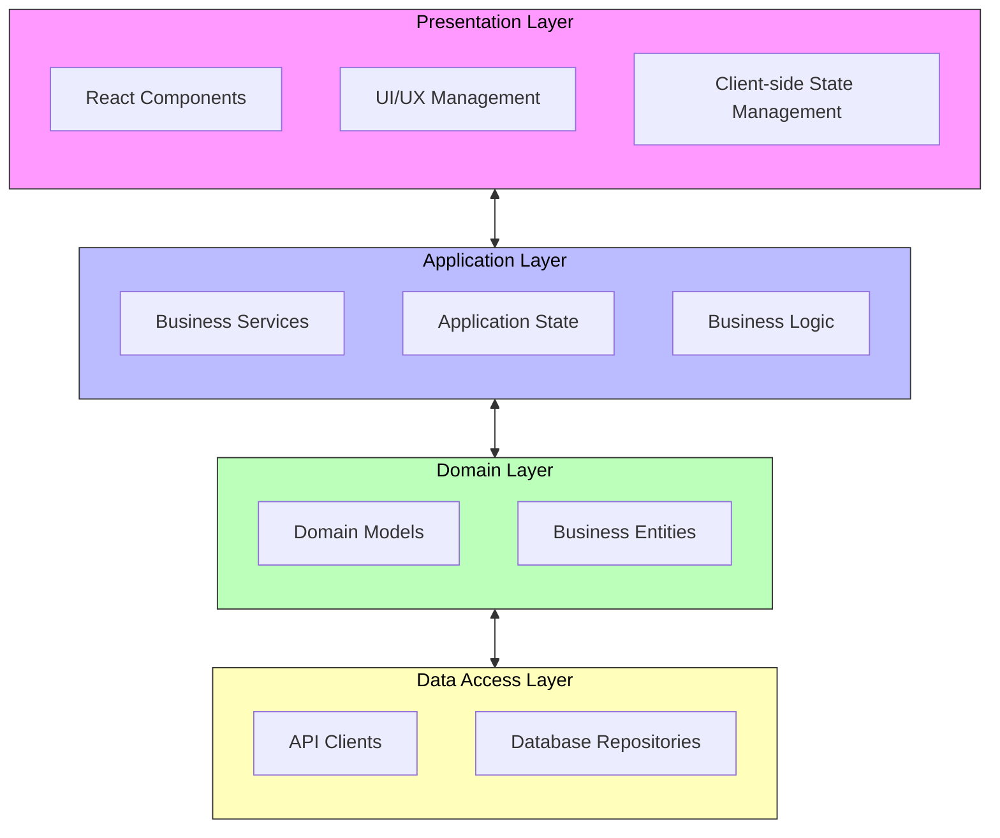

# Task Management System

## Complete Implementation Guide

### A Comprehensive Technical Guide from Design to Implementation

Version: 1.0

Date: March 21, 2025

Author: Leeroy D'Souza + Perplexity AI +  Phind.com

| Table of Contents |
| --- |
| Introduction |
| Project Overview |
| System Architecture |
| Design Principles |
| Implementation Guide |
| Project Setup |
| Domain Models |
| Services Layer |
| UI Components |
| State Management |
| API Integration |
| Testing Strategy |
| Deployment Process |
| Glossary |
| Conclusion and Next Steps |

## Introduction

This technical document provides a comprehensive, step-by-step guide for implementing a Task Management System using industry-standard software engineering practices. The system is designed to help users efficiently organize, track, and complete tasks through an intuitive interface.

The implementation follows a structured approach incorporating several key software engineering principles:

- Gang of Four (GoF) Design Patterns: Proven solutions to common software design problems
- DRY (Don't Repeat Yourself): Eliminating code duplication through abstraction
- Clean Code Practices: Following Robert C. Martin's guidelines for maintainable code
- Professional UI/UX Standards: Implementing user-centered design principles

This document serves as a complete reference for developers implementing or maintaining the system, with detailed explanations and code examples for each component.

## Project Overview

### 1.1 System Purpose

The Task Management System provides a comprehensive solution for individuals and teams to:

- Create and organize tasks with detailed metadata
- Prioritize work based on importance and deadlines
- Track progress through customizable workflows
- Collaborate with team members on shared tasks
- Generate insights through reporting and analytics

### 1.2 Key Features

1. Task Creation and Management: Create, edit, and delete tasks with rich metadata
2. Task Organization: Categorize tasks by project, priority, and status
3. Task Visualization: Multiple views including list, calendar, and kanban board
4. Collaboration: Assign tasks, add comments, and track activity
5. Notifications: Receive alerts for deadlines and status changes
6. Reporting: Generate insights on productivity and task completion

### 1.3 Technical Requirements

- Frontend: React.js with TypeScript
- Backend: Node.js with Express
- Database: MongoDB for data persistence
- Authentication: JWT-based authentication
- Testing: Jest for unit and integration tests
- Deployment: Docker containerization for easy deployment

## System Architecture

### 2.1 High-Level Architecture



The diagram above illustrates the four-layer architecture of our system, where:

- Pink (Presentation Layer): Handles all user interactions and UI rendering
- Blue (Application Layer): Contains core business services and application logic
- Green (Domain Layer): Manages domain-specific entities and models
- Yellow (Data Access Layer): Handles external communications and data persistence

The bidirectional arrows indicate that data can flow both ways between adjacent layers, while each layer maintains clear boundaries and responsibilities. Within each layer, components work together to handle specific aspects of the system's functionality.

### 2.2 Component Diagram

```mermaid
flowchart TD
    subgraph TM["Task Management System"]
        direction TB
        
        subgraph Core["Core Modules"]
            direction LR
            TM[TM]
            UM[UM]
            PM[PM]
        end
        
        subgraph Dash["Dashboard Components"]
            direction LR
            DO[DO]
            ST[ST]
            AC[AC]
        end
        
        subgraph Noti["Notification System"]
            direction LR
            NO[NO]
            AL[AL]
            NS[NS]
        end
        
        subgraph Rep["Reporting System"]
            direction LR
            RO[RO]
            CH[CH]
            EX[EX]
        end
        
        %% Connections
        TM --> DO
        TM --> ST
        TM --> AC
        
        UM --> AL
        UM --> NS
        
        PM --> RO
        PM --> CH
        PM --> EX
    end
    
    %% Legend
    subgraph Legend["Legend"]
        direction LR
        TM_L[TM]:::tm
        UM_L[UM]:::um
        PM_L[PM]:::pm
        
        style TM_L fill:#f9f,stroke:#333,color:#000
        style UM_L fill:#bbf,stroke:#333,color:#000
        style PM_L fill:#bfb,stroke:#333,color:#000
    end
    
    %% Styling
    classDef tm fill:#f9f,stroke:#333,color:#000
    classDef um fill:#bbf,stroke:#333,color:#000
    classDef pm fill:#bfb,stroke:#333,color:#000
```

The component diagram above illustrates the system's modular architecture, where:

- Pink Modules (TM): Task Management core functionality
- Blue Modules (UM): User Management and authentication
- Green Modules (PM): Project Management features

Each module group contains specialized components:

- Dashboard Components (DO, ST, AC): Overview, Statistics, Activity tracking
- Notification System (NO, AL, NS): Notifications, Alerts, Settings
- Reporting System (RO, CH, EX): Reports, Charts, Exports

Arrows indicate direct dependencies between components, showing how data flows through the system. For example, the Task Management module feeds into Dashboard components for visualization and reporting.

### 2.3 Directory Structure

```plaintext
task-management-system/
├── public/                  # Static assets
├── src/
│   ├── assets/              # Images, fonts, etc.
│   ├── components/          # Reusable UI components
│   │   ├── common/          # Shared components
│   │   ├── tasks/           # Task-related components
│   │   ├── projects/        # Project-related components
│   │   └── users/           # User-related components
│   ├── config/              # Configuration files
│   ├── constants/           # Application constants
│   ├── contexts/            # React contexts
│   ├── hooks/               # Custom React hooks
│   ├── models/              # Domain models
│   ├── pages/               # Page components
│   ├── services/            # Business logic services
│   ├── styles/              # Global styles
│   ├── utils/               # Utility functions
│   ├── App.tsx              # Main application component
│   └── index.tsx            # Application entry point
├── tests/                   # Test files
│   ├── unit/                # Unit tests
│   ├── integration/         # Integration tests
│   └── e2e/                 # End-to-end tests
├── .eslintrc.js             # ESLint configuration
├── .gitignore               # Git ignore file
├── jest.config.js           # Jest configuration
├── package.json             # NPM package configuration
├── tsconfig.json            # TypeScript configuration
└── README.md                # Project documentation
```

## Design Principles

### 3.1 Clean Code Principles

We follow Robert C. Martin's clean code principles throughout the implementation:

#### 3.1.1 Meaningful Names

```typescript
// Poor naming
const ts = new TS();
const d = new Date();
function up(i, o) { /* ... */ }

// Clean naming
const taskService = new TaskService();
const dueDate = new Date();
function updatePriority(taskId, newPriority) { /* ... */ }
```

#### 3.1.2 Small Functions

```typescript
// Complex function with multiple responsibilities
function processTask(task: Task) {
  // Validation
  if (!task.title) throw new Error("Title is required");
  if (!task.dueDate) throw new Error("Due date is required");
  
  // Database update
  db.tasks.update(task.id, task);
  
  // Notification
  if (task.assignee) {
    const user = db.users.findById(task.assignee);
    sendEmail(user.email, `Task assigned: ${task.title}`);
  }
  
  return task;
}

// Refactored into smaller, focused functions
function processTask(task: Task) {
  validateTask(task);
  updateTaskInDatabase(task);
  notifyAssignee(task);
  return task;
}
```

#### 3.1.3 DRY (Don't Repeat Yourself)

```typescript
// Violating DRY principle
function formatTaskDueDate(task: Task) {
  const date = new Date(task.dueDate);
  return `${date.getFullYear()}-${date.getMonth() + 1}-${date.getDate()}`;
}

function formatTaskCreationDate(task: Task) {
  const date = new Date(task.createdAt);
  return `${date.getFullYear()}-${date.getMonth() + 1}-${date.getDate()}`;
}

// Following DRY principle
function formatDate(dateString: string) {
  const date = new Date(dateString);
  return `${date.getFullYear()}-${date.getMonth() + 1}-${date.getDate()}`;
}
```

### 3.2 Gang of Four Design Patterns

We implement several Gang of Four design patterns to solve common design problems:

1. Observer Pattern: Used for notifying components when tasks are created, updated, or deleted
2. Factory Pattern: Used to create different types of tasks (regular, recurring, collaborative)
3. Strategy Pattern: Used for implementing different filtering and sorting strategies for tasks
4. Decorator Pattern: Used to add visual indicators and behaviors to task items based on their properties

### 3.3 UI/UX Best Practices

Our UI/UX implementation follows these key principles:

1. User-Centered Design: Design focused on user needs and goals
2. Visual Hierarchy: Clear organization of information by importance
3. Accessibility: WCAG 2.1 AA compliance
4. Responsive Design: Fluid layouts that adapt to different screen sizes

## Implementation Guide

### 4.1 Project Setup

```bash
# Create a new React application with TypeScript
npx create-react-app task-management-system --template typescript

# Navigate to the project directory
cd task-management-system

# Install additional dependencies
npm install react-router-dom @types/react-router-dom
npm install axios @types/axios
npm install styled-components @types/styled-components
npm install date-fns @types/date-fns
npm install uuid @types/uuid
npm install react-icons
npm install react-beautiful-dnd @types/react-beautiful-dnd

# Install development dependencies
npm install --save-dev jest @testing-library/react @testing-library/jest-dom
npm install --save-dev eslint eslint-plugin-react eslint-plugin-react-hooks
```

### 4.2 Domain Models

```typescript
// src/models/Task.ts
import { v4 as uuidv4 } from 'uuid';

export type TaskPriority = 'low' | 'medium' | 'high';
export type TaskStatus = 'pending' | 'in-progress' | 'completed' | 'archived';

export class Task {
  id: string;
  title: string;
  description: string;
  dueDate: string;
  priority: TaskPriority;
  status: TaskStatus;
  categories: string[];
  createdAt: Date;
  updatedAt: Date;
  type: string;

  constructor(
    title: string,
    description: string,
    dueDate: string,
    priority: TaskPriority,
    status: TaskStatus = 'pending',
    categories: string[] = [],
    id?: string
  ) {
    this.id = id || uuidv4();
    this.title = title;
    this.description = description;
    this.dueDate = dueDate;
    this.priority = priority;
    this.status = status;
    this.categories = categories;
    this.createdAt = new Date();
    this.updatedAt = new Date();
    this.type = 'regular';
  }

  update(properties: Partial<Task>): Task {
    Object.assign(this, properties);
    this.updatedAt = new Date();
    return this;
  }

  isOverdue(): boolean {
    return new Date() > new Date(this.dueDate) && this.status !== 'completed';
  }

  toJSON(): Record<string, any> {
    return {
      id: this.id,
      title: this.title,
      description: this.description,
      dueDate: this.dueDate,
      priority: this.priority,
      status: this.status,
      categories: this.categories,
      createdAt: this.createdAt.toISOString(),
      updatedAt: this.updatedAt.toISOString(),
      type: this.type
    };
  }
}
```
## 4.3 Services Layer

The services layer implements the business logic of our application, handling complex operations and coordinating between different components. Here's the implementation of our TaskService:

```typescript
// src/services/TaskService.ts
import { Task } from '../models/Task';
import { TaskRepository } from '../repositories/TaskRepository';
import { TaskPriority, TaskStatus } from '../models/Task';

export class TaskService {
  private taskRepository: TaskRepository;

  constructor(taskRepository: TaskRepository) {
    this.taskRepository = taskRepository;
  }

  async createTask(taskData: Omit<Task, 'id' | 'createdAt' | 'updatedAt'>): Promise<Task> {
    const task = new Task(
      taskData.title,
      taskData.description,
      taskData.dueDate,
      taskData.priority,
      taskData.status,
      taskData.categories
    );

    return this.taskRepository.create(task);
  }

  async updateTask(taskId: string, updates: Partial<Task>): Promise<Task> {
    const task = await this.taskRepository.findById(taskId);
    if (!task) {
      throw new Error('Task not found');
    }

    Object.assign(task, updates);
    task.updatedAt = new Date();

    return this.taskRepository.update(task);
  }

  async deleteTask(taskId: string): Promise<void> {
    await this.taskRepository.delete(taskId);
  }

  async getTasks(filter: any = {}, options: any = {}): Promise<Task[]> {
    return this.taskRepository.find(filter, options);
  }

  async getOverdueTasks(): Promise<Task[]> {
    const now = new Date();
    return this.taskRepository.find({
      dueDate: { $lt: now },
      status: { $ne: 'completed' }
    });
  }
}
```

## 4.4 UI Components

The UI components are built using React and styled-components, following our UI/UX best practices:

```typescript
// src/components/Tasks/TaskList.tsx
import React from 'react';
import styled from 'styled-components';
import { Task } from '../../models/Task';
import { TaskPriority } from '../../models/Task';

const TaskListContainer = styled.div`
  display: grid;
  grid-template-columns: repeat(auto-fill, minmax(300px, 1fr));
  gap: 1rem;
  padding: 1rem;
`;

const TaskCard = styled.div<{ priority: TaskPriority }>`
  border-radius: 8px;
  padding: 1rem;
  background: white;
  box-shadow: 0 2px 4px rgba(0, 0, 0, 0.1);
  border-left: 4px solid ${props => {
    switch (props.priority) {
      case 'high': return '#ff4444';
      case 'medium': return '#ffbb33';
      case 'low': return '#00C851';
      default: return '#dddddd';
    }
  }};
`;

interface TaskListProps {
  tasks: Task[];
  onTaskClick?: (task: Task) => void;
}

export const TaskList: React.FC<TaskListProps> = ({ tasks, onTaskClick }) => {
  return (
    <TaskListContainer>
      {tasks.map(task => (
        <TaskCard
          key={task.id}
          priority={task.priority}
          onClick={() => onTaskClick?.(task)}
          role="button"
          tabIndex={0}
        >
          <h3>{task.title}</h3>
          <p>{task.description}</p>
          <div>
            <span>Due: {new Date(task.dueDate).toLocaleDateString()}</span>
            <span>Priority: {task.priority}</span>
          </div>
        </TaskCard>
      ))}
    </TaskListContainer>
  );
};
```

## 4.5 State Management

We use React Context API for global state management, with TypeScript for type safety:

```typescript
// src/contexts/TaskContext.tsx
import React, { createContext, useContext, useReducer } from 'react';
import { Task } from '../models/Task';

interface TaskState {
  tasks: Task[];
  loading: boolean;
  error: string | null;
}

interface TaskAction {
  type: 'SET_TASKS' | 'SET_LOADING' | 'SET_ERROR';
  payload?: any;
}

const initialState: TaskState = {
  tasks: [],
  loading: false,
  error: null
};

const taskReducer = (state: TaskState, action: TaskAction): TaskState => {
  switch (action.type) {
    case 'SET_TASKS':
      return { ...state, tasks: action.payload, loading: false };
    case 'SET_LOADING':
      return { ...state, loading: action.payload };
    case 'SET_ERROR':
      return { ...state, error: action.payload, loading: false };
    default:
      return state;
  }
};

const TaskContext = createContext<{
  state: TaskState;
  dispatch: React.Dispatch<TaskAction>;
}>({
  state: initialState,
  dispatch: () => null
});

export const TaskProvider: React.FC<{ children: React.ReactNode }> = ({ children }) => {
  const [state, dispatch] = useReducer(taskReducer, initialState);

  return (
    <TaskContext.Provider value={{ state, dispatch }}>
      {children}
    </TaskContext.Provider>
  );
};

export const useTasks = () => useContext(TaskContext);
```

## 4.6 API Integration

The API client handles all communication with the backend:

```typescript
// src/services/api.ts
import axios, { AxiosError } from 'axios';

const api = axios.create({
  baseURL: process.env.REACT_APP_API_URL,
  headers: {
    'Content-Type': 'application/json'
  }
});

export const setAuthToken = (token: string | null) => {
  if (token) {
    api.defaults.headers.common['Authorization'] = `Bearer ${token}`;
  } else {
    delete api.defaults.headers.common['Authorization'];
  }
};

export const handleApiError = (error: AxiosError) => {
  if (error.response) {
    throw new Error(error.response.data.message || error.response.statusText);
  }
  throw error;
};

export const apiClient = {
  get: async <T>(url: string): Promise<T> => {
    const response = await api.get<T>(url);
    return response.data;
  },
  post: async <T>(url: string, data: any): Promise<T> => {
    const response = await api.post<T>(url, data);
    return response.data;
  },
  put: async <T>(url: string, data: any): Promise<T> => {
    const response = await api.put<T>(url, data);
    return response.data;
  },
  delete: async <T>(url: string): Promise<T> => {
    const response = await api.delete<T>(url);
    return response.data;
  }
};
```

## 4.7 Testing Strategy

Our testing approach follows the pyramid principle 8:1:

1. Unit Tests (70%):
```typescript
// tests/services/TaskService.test.ts
import { TaskService } from '../../src/services/TaskService';
import { TaskRepository } from '../../src/repositories/TaskRepository';

jest.mock('../../src/repositories/TaskRepository');

describe('TaskService', () => {
  let taskService: TaskService;
  let taskRepository: jest.Mocked<TaskRepository>;

  beforeEach(() => {
    taskRepository = new TaskRepository() as jest.Mocked<TaskRepository>;
    taskService = new TaskService(taskRepository);
  });

  test('should create a new task', async () => {
    const taskData = {
      title: 'Test Task',
      description: 'Test description',
      dueDate: new Date(),
      priority: 'medium',
      status: 'pending'
    };

    taskRepository.create.mockResolvedValue({
      ...taskData,
      id: '1',
      createdAt: new Date(),
      updatedAt: new Date()
    });

    const result = await taskService.createTask(taskData);
    expect(result).toMatchObject(taskData);
    expect(result.id).toBeDefined();
  });
});
```


2. Integration Tests (20%):
```typescript
// tests/integration/api.test.ts
import request from 'supertest';
import app from '../../src/app';

describe('API Integration Tests', () => {
  test('should create a new task', async () => {
    const taskData = {
      title: 'Test Task',
      description: 'Test description',
      dueDate: new Date(),
      priority: 'medium',
      status: 'pending'
    };

    const response = await request(app)
      .post('/api/tasks')
      .send(taskData)
      .expect('Content-Type', /json/)
      .expect(201);

    expect(response.body).toMatchObject(taskData);
    expect(response.body.id).toBeDefined();
  });
});
```


3. End-to-End Tests (10%):
```typescript
// tests/e2e/task.e2e.test.ts
import { chromium } from 'playwright';

describe('Task Management E2E Tests', () => {
  jest.setTimeout(30000);

  test('should create and display a new task', async () => {
    const browser = await chromium.launch();
    const page = await browser.newPage();
    await page.goto('http://localhost:3000');

    await page.click('text="Add New Task"');
    await page.fill('input[name="title"]', 'E2E Test Task');
    await page.fill('textarea[name="description"]', 'E2E test description');
    await page.selectOption('select[name="priority"]', 'medium');
    await page.click('text="Save"');

    await page.waitForSelector('text="E2E Test Task"');
    await browser.close();
  });
});
```


## 4.8 Deployment Process

Based on 6:0, our deployment process uses Docker for containerization:

```yaml
# docker-compose.yml
version: "3.8"

services:
  frontend:
    build:
      context: ./frontend
      dockerfile: Dockerfile
    ports:
      - "3000:3000"
    depends_on:
      - backend
    environment:
      - REACT_APP_API_URL=http://backend:3000/api
    volumes:
      - ./frontend:/usr/src/app

  backend:
    build:
      context: ./backend
      dockerfile: Dockerfile
    ports:
      - "3000:3000"
    depends_on:
      - mongo
    environment:
      - MONGODB_URL=mongodb://mongo:27017/task-management
      - JWT_SECRET=${JWT_SECRET}
      - NODE_ENV=production
    volumes:
      - ./backend:/usr/src/app

  mongo:
    image: mongo:latest
    volumes:
      - mongo-data:/data/db

volumes:
  mongo-data:
```

## 4.9 Glossary

- API: Application Programming Interface - defines how different parts of the system communicate
- Container: A lightweight and portable encapsulation of an application and its dependencies
- Dependency Injection: A design pattern where components receive their dependencies rather than creating them
- JWT: JSON Web Token - a secure way to transmit information between parties
- MongoDB: A NoSQL document-based database system
- React: A JavaScript library for building user interfaces
- TypeScript: A typed superset of JavaScript that compiles to plain JavaScript

## 4.10 Conclusion and Next Steps

This documentation provides a comprehensive guide to implementing the Task Management System. The system follows industry best practices and provides a solid foundation for future enhancements.

Recommended next steps:

1. Set up continuous integration and deployment pipelines
2. Implement monitoring and logging solutions
3. Add more advanced features based on user feedback
4. Regular security audits and updates
5. Performance optimization and scaling improvements

The system is designed to be maintainable, scalable, and extensible, allowing for easy addition of new features while maintaining high code quality and reliability.
